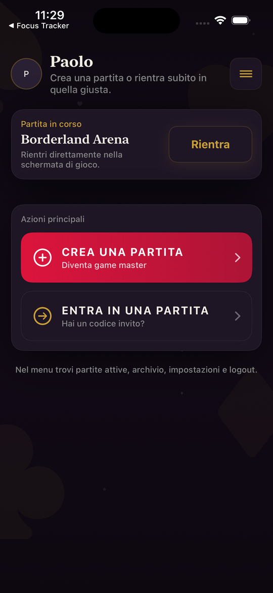
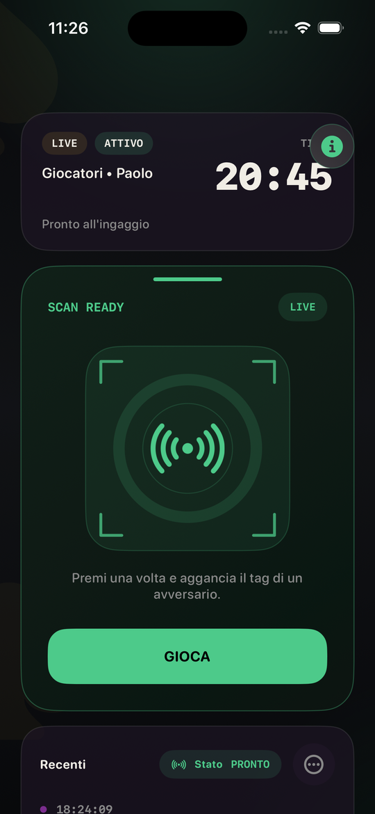
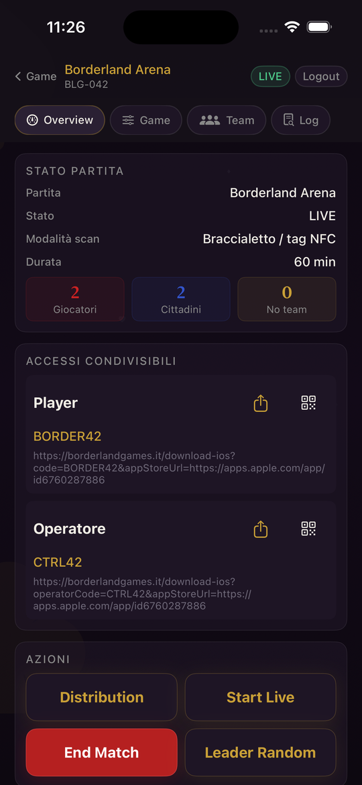
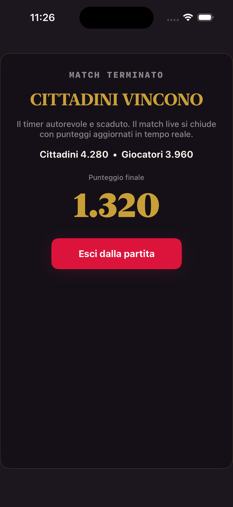

# Game Start! (iOS)

App companion per giochi dal vivo a squadre, organizzati su invito. Chi organizza
crea la partita, registra i giocatori al check-in con un tag NFC o un QR e segue
la control room; chi gioca entra con un codice, vede la lobby, il proprio ruolo e
l'esito. Il backend (Firebase Auth e Cloud Functions) è condiviso con la PWA e con
l'app Android dello stesso progetto.

Stato: build 30 (1.0.3) in TestFlight. Non ancora sull'App Store.

## Screenshot

Le immagini vengono dalla modalità screenshot interna dell'app, con dati di esempio
(vedi sotto), non da una partita reale.

| Home | Gameplay | Control room | Esito |
|---|---|---|---|
|  |  |  |  |

## Cosa c'è dentro

- SwiftUI, iOS 17, `ObservableObject` per gli stati di schermata, async/await per
  le chiamate al backend.
- **CoreNFC**: `NFCTagReaderSession` per il check-in dei giocatori con tag fisici
  (`Services/CoreNFCService.swift`).
- **AVFoundation**: scanner QR con `AVCaptureSession` e `AVCaptureMetadataOutput`,
  incapsulato in un `UIViewController` portato in SwiftUI
  (`DesignSystem/Components/QRCodeScannerSheet.swift`).
- **CoreImage**: generazione dei QR con `CIFilter.qrCodeGenerator()`.
- Firebase Auth con Sign in with Apple, Google Sign-In ed email; Cloud Functions
  callable per tutte le scritture (nessun accesso diretto a Firestore dal client);
  push con Firebase Messaging.
- PhotosUI per le foto profilo, `UNUserNotificationCenter` per i permessi push.

Dipendenze via Swift Package Manager: Firebase iOS SDK, GoogleSignIn.

## Struttura

```
ABG/
  Features/      Onboarding, Auth, Home, GameHub, GameSelection, GameEntry,
                 Lobby, GameLobby, Player, TeamRoster, Distribution, Admin
  Services/      auth (Apple, Google, Firebase), giochi (callable), NFC
  Models/        utente, ruoli, definizione di gioco, snapshot partita, catalogo carte
  Core/          container delle dipendenze, configurazione, routing
  DesignSystem/  componenti condivisi, QR, tema
```

I nomi nel codice sono in italiano, come il prodotto.

## Build

1. Scarica `GoogleService-Info.plist` dal progetto Firebase e mettilo in `ABG/`
   (il file non è nel repo).
2. `scripts/check_setup.sh` controlla che ci sia tutto.
3. Apri `ABG.xcodeproj` e lancia lo schema `ABG`.

Setup completo di Firebase e Sign in with Apple: `SETUP_FROM_ZERO.md` e
`SIGN_IN_WITH_APPLE_SETUP.md`. Note per l'invio in review: `APP_STORE_SUBMISSION.md`.

### Modalità screenshot

Per generare le schermate di marketing senza un backend:

```
xcrun simctl launch <device> paolo.ABG -app-store-screenshots -app-store-screenshot-scene=home
```

Scene disponibili: `login`, `home`, `profile`, `gameplay`, `result`, `control-room`.
